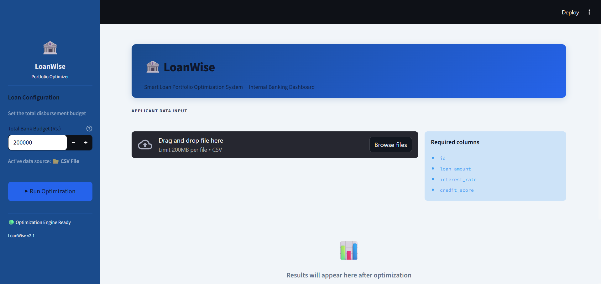
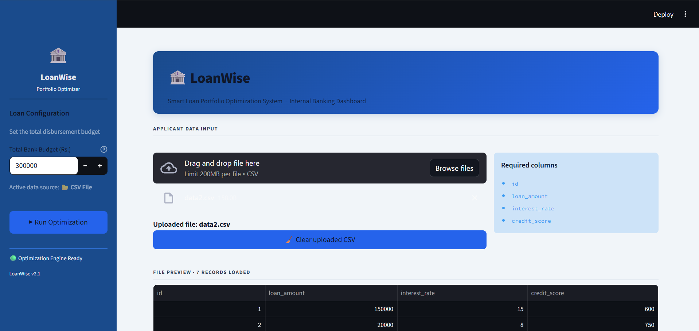
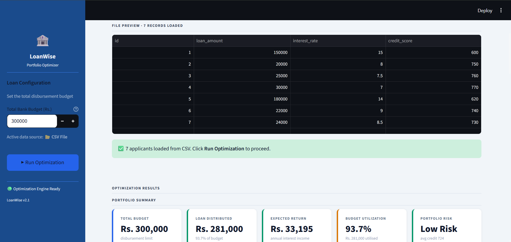
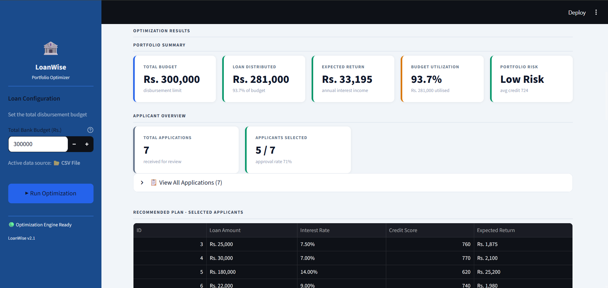
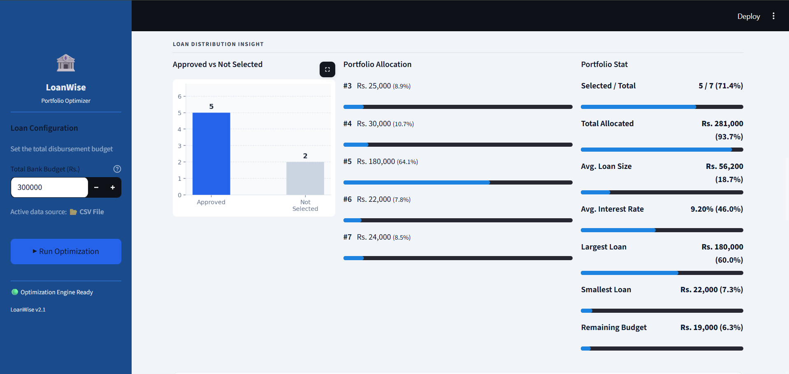
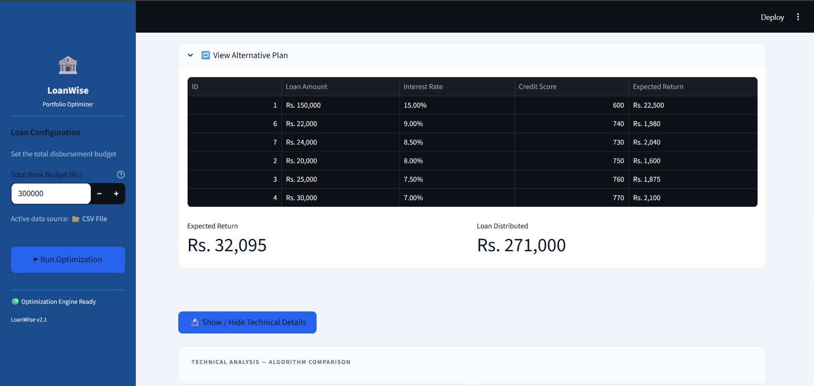
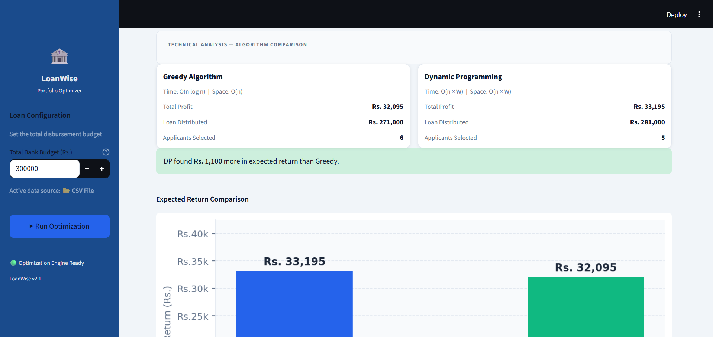
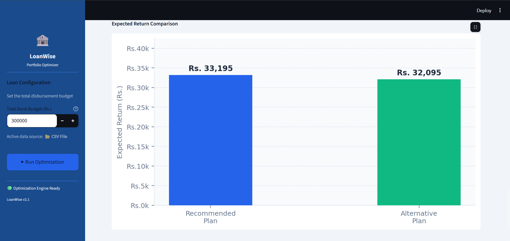

<div align="center">

# 🏦 LoanWise

<p>A bank loan portfolio optimizer that compares Greedy and Dynamic Programming side by side.</p>


</div>

---

## What is this?

Banks get more loan requests than they can fund. LoanWise finds the best combination of loans to approve — maximizing profit without exceeding the budget.

It solves the **0/1 Knapsack problem** two ways and lets you compare the results:

| Algorithm | Time Complexity | Always Optimal? |
|-----------|----------------|-----------------|
| Greedy | O(n log n) | ❌ |
| Dynamic Programming | O(n × W) | ✅ |

---

## Screenshots

### Home


### Upload CSV


### File Preview


### Portfolio Summary


### Loan Distribution


### Alternative Plan


### Technical Analysis — Greedy vs DP


### Expected Return Comparison


---

## How it works

```
You upload a CSV  →  Python calls C++ binary  →  C++ runs both algorithms
→  returns JSON  →  Streamlit renders the dashboard
```

The C++ engine handles all the computation and outputs a clean JSON response. Python doesn't touch the algorithm logic — it just sends data in and displays what comes back.

---

## Project structure

```
LoanWise/
├── backend/
│   ├── main.cpp          ← entry point, reads CSV, outputs JSON
│   ├── greedy.cpp/h      ← greedy algorithm
│   ├── dp.cpp/h          ← 0/1 knapsack DP
│   ├── utils.cpp/h       ← CSV parser, data structs, JSON helpers
│   └── Makefile
├── frontend/
│   ├── streamlit_app.py  ← the entire dashboard
│   └── requirements.txt
├── data/                 ← sample CSV files to test with
├── images/               ← screenshots
├── .gitignore
├── LICENSE
├── requirements.txt
└── README.md
```

---

## Getting Started

**1. Compile the C++ backend**

```bash
cd backend
g++ -std=c++17 -O2 -o loan_optimizer main.cpp greedy.cpp dp.cpp utils.cpp
```

> Windows: use `loan_optimizer.exe` as the output name

**2. Install dependencies**

```bash
pip install -r requirements.txt
```

**3. Run**

```bash
cd frontend
streamlit run streamlit_app.py
```

Opens at `http://localhost:8501`

---

## CSV Format

```csv
id,loan_amount,interest_rate,credit_score
1,50000,7.5,720
2,30000,9.0,680
```

Sample files are in the `data/` folder. Start with `data5.csv`.

---

## Troubleshooting

| Problem | Fix |
|---------|-----|
| "Engine Not Found" | Compile the C++ backend first |
| `g++ not found` | Windows: install [MinGW](https://www.mingw-w64.org/) · Linux: `sudo apt install g++` |
| `ModuleNotFoundError` | `pip install -r requirements.txt` |
| Blank page | Wait 5–10 seconds on first load |

---

## License

MIT — free to use and modify. See [LICENSE](LICENSE).

---

<div align="center">

**Vaibhav Khandelwal**  
B.Tech CSE · Jaypee Institute of Information Technology, Noida

[](https://github.com/Vaibhav-code15)
[](https://www.linkedin.com/in/vaibhav-khandelwal-5a532b28a/)

*If this helped you, a star would mean a lot ⭐*

</div>
